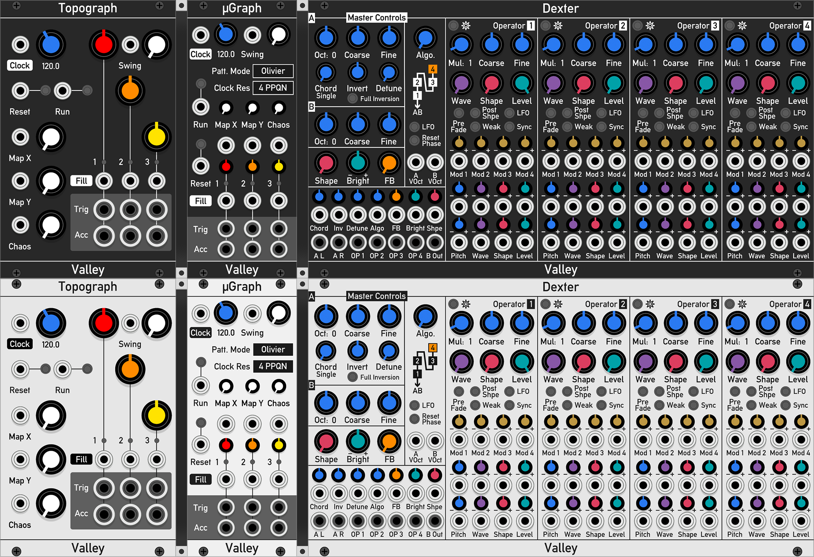

# ValleyRack Free

3rd party plugins for VCV Rack version 2.0.x

**This is currently in beta and has only been tested on macOS**. Build and use at your own peril.

## Version

2.0.0b

## Compatibility

The modules are Mac, Windows and Linux compatible. Some source is inherently open source, so you are free to download / clone and build on your own computer. See the appropriate license information for more details.

You must have at least Rack v2.0.0 use these modules.

## Modules

* Topograph - A port of the Mutable Instruments "Grids", the rhythm sequencer module that was missing from the VCV Audible Instruments plugin bundle. Covered by GPL-3.0 license.
* µGraph - Same as Topograph except more compact. It does, however, default to the Olivier pattern modes rather than Henri.
* Dexter - An FM wavetable oscillator with tonnes of modulation inputs, phase shaping and synchronisation options, as well multiple outputs from 2 separate voices and each operator.
* Plateau - A plate reverb with a twist. Can add large expansive textures to your
sounds, as well as be able to be tuned and excited at very short reverb times. It is based on the
well known Dattorro (1997) plate reverb algorithm.
* Amalgam - A signal masher and multipler
* Interzone - A complete, monophonic, virtual analogue synth voice
* Terrorform - A wavetable oscillator based of the operator section of Dexter, but far more enhanced. Allows for loading of user wavetables.

## Installation

As of now there is no release. Please clone this repo, then build and use at your own peril....

## Usage
See the official [Valley Audio Soft](https://valleyaudio.github.io/index.html) website for complete documentation of all of the modules in this plugin.

## Bibliography

Dattorro, J. (1997). Effect design part 1: Reverberator and other filters, J. Audio Eng. Soc, 45(9), 660-684.

## License

All code is licensed under GNU Public License v3.0, Copyright (c) 2020 Dale Johnson
