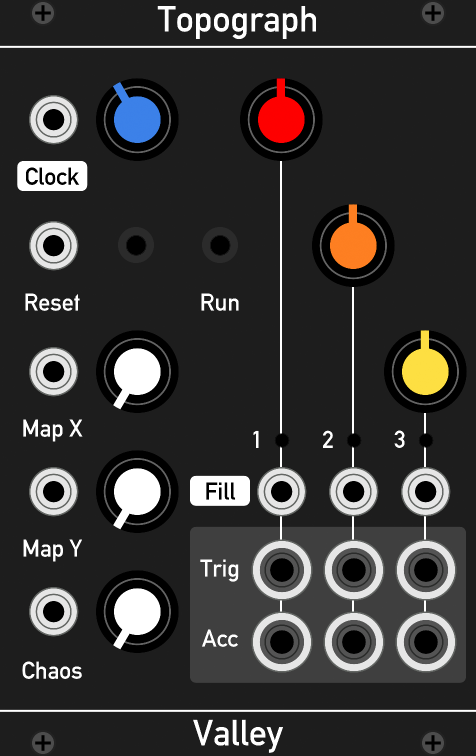

# ValleyRack Free

3rd party plugins for VCV Rack version 0.5.0

### Version

0.5.1

### Compatibility

The modules are **currently Mac and Windows only**. Linux version will follow shortly. Some source is inherently open source, so you are free to download / clone and build on your own computer. See the appropriate license information for more information.

### Modules

* Topograph - A port of the Mutable Instruments "Grids", the rhythm sequencer module that was missing from the VCV Audible Instruments plugin bundle. Covered under the GPL-3.0 license.

### Installation

Download and extract the .zip file from this git repository under releases, then place the extracted folder in:

	Mac - ~/Documents/Rack/plugins
	Windows /My Documents/Rack/plugins

## Usage

### Topograph

The behaviour of this module is nearly identical to the hardware version of "Grids", and therefore it is worth familiarising yourself with it by visiting the Mutable Instruments' [website](https://mutable-instruments.net/modules/grids/).

This module is a rhythm sequencer module. Yet, unlike the usual x0x style drum machine this module contains a vast "map" of drum rhythms that can be cross-faded and explored in a continuous fashion. There are 3 drum lines (Kick, Snare and Hats) each with their own Fill knob, Trigger and Accent outputs. The fill knobs control the density of the given drum line pattern. The higher the setting, the denser the pattern. The fill amounts can be randomly varied using the Chaos control.

The drum map is explored using the Map X and Y knobs. Finally, the Tempo knob controls the speed of the sequencer.

To control the sequencer from an external clock, turn the Tempo knob fully counter-clockwise and patch a clock source to the clock input. The clock input does not upscale a low frequency clock so you must supply a 32ppqn (pulses per quarter note) clock into it to get the correct tempo.

All controls have a CV input to control them. These are the silver jacks.

Currently the module does not have Euclidean mode.

## Todo
* Topograph
	* Implement Euclidean mode and ACC alt modes (can be right-click menu items)

## Future

I've only just begun to get really into the Rack API. I can see a lot of promise for this project thanks to positive community spirit. I hope to produce more modules based on some of my existing work which mainly focuses on reverb and other effects.

Watch this space!

## License

Topograph is covered by GPL-3.0

Topograph's dependencies "LED" and "Metronome" are covered by BSD-3-Clause
